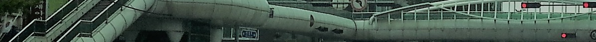

# Cross
## 제 1화 [만남]

```
"내 꿈을 이뤄 줄 누군가를 만날 수 있다면 얼마나 좋을까 ?"
```
어두운 도시 속 깜빡이는 형광등 간판 뒤편 고시원 쪽창문 너머로 책상 앞에서 무언가 생각에 빠져 있는 정현이 보인다. 
정현은 마른체구에 짧은 머리를 하고 어울리지 않는 커다란 뿔테 안경을 끼고 내용을 알수 없는 수험서를 멍하니 보고 있다.
책상 한켠에는 벌써 5년이나 지난 공무원 수험서들과 생라면을 깨어 먹었는지 스프봉지들이 여러개 널려 있고, 그위에 A4용지에 언제쓴지도 모르겠지만 “D-12”라고 크게 적혀 있었다.
책을 멍하니 보고 있던 정현은 갑자기 가슴을 움켜쥐며 괴로워하다 숨을 내어 쉬며 가슴을 토닥거린다. 떨어질 시험이라고 생각해도 그 위압감으로 힘들어 하고 있는 것이다. 

정현은 희박한 가능성을 믿고 다달이 생활비를 보내 주시는 부모님께 거짓말을 하고 있는 것 같아 미안하고 변함없이 다가 오고 있는 공무원 입직시험만 생각하면 잠도 들지 못하고, 물도 소화되지 않고, 가슴은 돌을 심어 두었는지 답답하기만 했다.

한 시간 한 시간이... 아니 일분일초가 지옥과 같았다. 어떻게 자격요건은 맞추었지만 높은 경쟁률도 경쟁률이지만 필기시험 조차 통과할 자신이 없었다. 
필기시험과목이 공통과목이라 이 동네 저 동네 한다는 사람들은 한번씩 모두 응시할 것이라, 1~2문제만 틀려도 낙방이 뻔한 시험이었다.

답답한 마음에 정현은 혼잣말을 되뇌인다.
```
“아~ 누가 내소원을 들어 주면 얼마나 좋을까~” 
“아~ 이번시험만 어떻게 붙으면 얼마나 좋을까~~”
“아~ 소원을 들어 준다면....”
```
책이 눈에 들어오지 않던 정현은 그 깨끗한 책위로 머리를 떨구며 잠이 들고 만다.

그렇게 잠이든 정현은 꿈속에서 이상한 것을 보게 된다.
사방으로 건널 수 있는 하얀 뱀같은 구불구불한 육교를 건너서는 굽이굽이 골목을 돌아서며 들어가니 온통 검은색으로 도배를 벽면에 대문짝하게 “MEMBER SHIP ONLY 유흥주점”이라고 적혀있으면서 간판은 터무없게 손바닥 두장정도되는 되지 않게 작게 “빨간수박”고 적혀있었고 그 속에서 누군가를 만나는 정현 자신을 보았고, 
그 상대의 얼굴은 빛이 나고 있었으며 내 소원을 이루어 줄 사람이라는 것을 꿈속에서 믿어 의심하지 않고 있는 자신을 보며 꼭 그곳으로 가야 할 것을 느꼈다.

꼭 가야 할 것을 느낀 정현은 그곳이 어딘지 알려고 필사적으로 주변을 두리번 거렸다. 여기가 어디지 처음본곳이 분명했다... 그때 꿈이 깨려는 듯 지나온 길들이 휘날리며 지나 가려던중 사방으로 건널수 있는 육교옆에 은행 간판이 눈에 들어 왔다.....
분명 책상에 누워서 잠이 들었던 정현이였는데 침대에 반듯이 누워서 눈을 번쩍 뜨며 외쳤다. “범일동 지점”
정현은 식은땀에 범벅이 되어 있었고, 오른팔은 너무 힘을 주어서인지 저려올 정도로 힘을 주어 주먹을 쥐고 있었다. 
꿈에서 깨어난 정현은 너무나 생생한꿈 그꿈속의 장소로 가야 할것이 자신의 운명임을 느꼈다. 노트북을 켜 “빨간수박”이라고 검색을 해봤지만 유흥주점은 나오지가 않았다. 그때 범일동지점을 검색하자 신기하게 범일동이라는 곳이 있었다. 해가 뜨면 그곳으로 가야 겠다는 것을 느꼈다. 하지만 돈이 없었다. 적어도 10만원은 넘게 있어야 부산까지 다녀올 수 있겠지만 수중에는 겨우 7만원과 동전 몇십개가 전 재산이였다.
정현은 부산행 KTX기차를 탓다. 무작정이었지만 오늘 가지 않으면 안될 것을 느꼈기 때문이다. 표를 사서 타고 싶었지만 5만원이 넘는 기차표값은 무리였고, 어떻게 싼가격으로 갈수 있는 방법을 찾아보려 했지만 그 운명의 꿈을 믿고 표도 없이 무작정 기차에 몸을 실었다.
빈자리에 앉아서 혹시 승무원이 자신을 발견할까봐 벌벌떨고 있을 때 새벽기차는 천천히 움직였다. 승무원이 두 번 지나 갔다. 각오는 하고 있었다. 무임승차로 승무원에게 잡혀 철도경찰로 넘겨질 것은 알고 있었다. 하지만 전 재산 7만원을 내꿈에 다 털어 넣고 싶지는 않았고 어떻게 되겠지 하는 생각에 벌벌떨다가 잠이 들었다.
대전을 지날때였다. 옆좌석에 30대 초반의 아름다운 여성이 앉으며 내게 물었다. “김형진 과장님이신가요?” 그때 알게 되었다. 내가 무턱대고 앉은 이 자리는 김형진이라는 사람이 이여성과 함께 부산에 고객을 만나기 위해 새벽에 예약한 자리라는 것을.... 
그 여성은 내게 원래 자리가 어딘지 내가 무임승차를 했다는 사실에 관심도 없었고 서울 본사와 그곳 다른 직원들에게 전화를 해서 김형진이라는 사람의 소재를 찾는데 정신이 없었다. 김형진이라는 사람의 집에도 전화를 했었지만 김형진이라는 사람은 전날 바이어를 접대한다고 나가서는 지금까지 연락이 되지 않고 있다는 것이였다. 그렇게 한시간 가량 전화로 실랑이를 하는 그녀를 보다 보니 어느덧 부산에 도착한 것을 알게되었다.
이것이 운명이라는 것을 느낀 정현의 눈은 더욱 반짝이며 가슴은 쿵쾅거렸다.

그렇게 부산역에 도착한 정현은 부산역에서 범일동까지 지하철을 타고 범일동역이라는 곳에 내렸다. 그런데 그 하얀 뱀과 같은 교차로의 사방으로 건너 갈수 있는 육교는 보이지 않았다.
누군가에게 물어야겠다고 생각한 정현은 주변을 살폈다. 거리에 가게는 즐비했지만 이상하게 모두 문을 열지 않았다. “이른 아침이라 아직 문을 열지 않았나 보구나...”하며 생각이 들 때 경비복장을 하고 무엇인가 옮기고 있는 노인을 발견하고 육교를 묻자 노인은 “교차로 위에 육교는 저쪽으로 내려가면 있는거 하나 뿐이여~”라며 큰길 저쪽으로 손가락으로 가르켰다.
쿵쾅대는 가슴으로 뛰어가던 정현은 꿈에본 그 사방으로 건너갈 수 있는 교차로 위에 뱀같이 하얀육교를 발견하고 그만 비명을 지를 뻔 했다.


그 육교 그 은행 범일동 지점 그러나 “빨간수박”은 보이지 않았다.
꿈속 이곳에서 어디로 해서 빨간 수박으로 갔었는지 전혀 기억이 나지 않았다.
점심때까지 주변을 헤매다 파출소를 찾아가 “‘빨간수박’이라는 유흥주점을 찾고 있습니다.”라고 말하자,늙은 경찰관 한명이 대낮부터 술집을 찾는 술에 미친놈을 보듯이 시큰둥하게 정현을 보며 지도앞으로 데려가 손짓을 하며 ”지금 게신곳이 여기인데.... 이쪽과 이쪽에 술집이 많이 모여 있는데.... 빨간수박이라는 간판은 못본 것 같은데 가서 한번 찾아 보세요 워낙 많이 생기고 없어지고 하니까....여기서도 다 알순 없어요”라고 안내해줘서 다시 오후가 되었다. 
역시 찾을 수 없었다. 아니 분명 이곳에 있는 것은 분명한데 주변 행인, 주변 가게, 파출소, 은행, 복덕방 그 누구에게 물어도 그런 술집을 알지 못했다.
역시 개꿈이 었나...... 어떻게 돌아 가지...... 이런 저런 생각과 배고픔에 후회가 밀려 오고 있었다. 
그때 번 듯 구청에 물어 보면 되겠다고 생각해서 전화로 구청에 “빨간수박”이라는 유흥주점 허가를 물어 봤지만 역시 그런 주점은 허가해준적이 없고 간판상호를 바꾸는 경우가 종종 있으니 사업자이름을 물으면 알 수 있다는 답이였다. 
정현은 답답해 미칠지경이었다. 갔었던 골목을 또 지나가고 다시 또 지나가고 뱀과 같은 그 하얀육교를 수십 수백번 건너가며 사방으로 “빨간수박”을 찾아 헤매었다.

어느덧 어둠이 내리고 있었고, 점심으로 초코파이 저녁으로 먹은 붕어빵으로 속은 쓰리고 “빨간수박”은 보이지 않았다. 이러는 모습에 정현은 자신이 한심스러웠다. 그러나 지난밤 꿈은 운명이고 자신의 꿈을 이루어줄 사람을 만날 것을 믿고 뚜벅 뚜벅 거리를 헤매고 있었다.

밤이 되었다. 어느 골목을 헤매던 정현의 호주머니에 있던 있던 붕어빵 빈봉지가 떨어졌고 그 봉지를 보기 위해 머리를 오른쪽으로 돌리는 순간 그렇게 찾아 헤매던 “빨간수박”이 보였다.
정말 양손바닥으로 간판을 가릴수 있는 크기의 간판에 검은색에 회검은 색으로 멤버전용 유흥주점이라고 적혀 있었다.
정현은 정말 얼마나 퇴폐적이면 유흥주점이면 이렇게 간판을 작게 하고 숨어 있을까 하고 떨리는 마음으로 주점의 문을 열었다.

정말 생각한것과 전혀 다른 술집의 모습이 보였다.
유흥주점이라는데 BAR였다. 바텐더는 검은색 쪼끼에 하얀긴팔 와이셔츠에 백옥같은 피부에 구렛나루와 턱수염을 기른 마른 체구의 20대 초반의 남자였고 피부는 하얗고 눈은 초록색 써클렌즈를 했는지 아니면 혼혈인지 초록색 눈빛이였다.
아.... 너무 비싸서 “Member only”구나..... 이런 생각으로 주변을 둘러 보았지만 바텐더 이외 다른 손님은 없었다...
바텐더가 웃으며 “멤버세요?”라고 묻자 정현은 엉겹결에 “네”라고 짧게 대답했다.바텐더는 이상한 듯 다시 “처음 오신거세요”라고 묻자 다시 “네~”라고 기어 들어 가는 소리로 대답했다.
정현은 “회원인데 처음왔다”니 이런 모순된 거짓말로 대답을 한 자신이 한심했다.
이런 저런 생각과 함께 “가격!....가격표....” 가격표를 찾기 시작했다.
